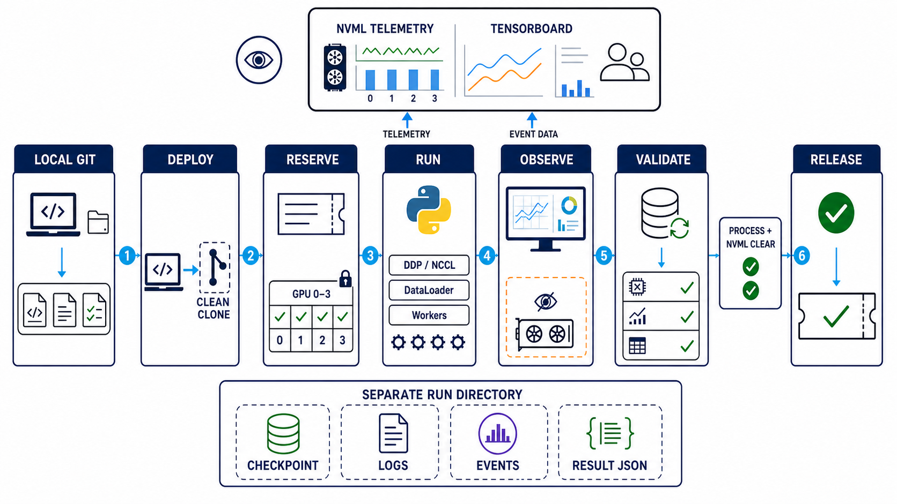
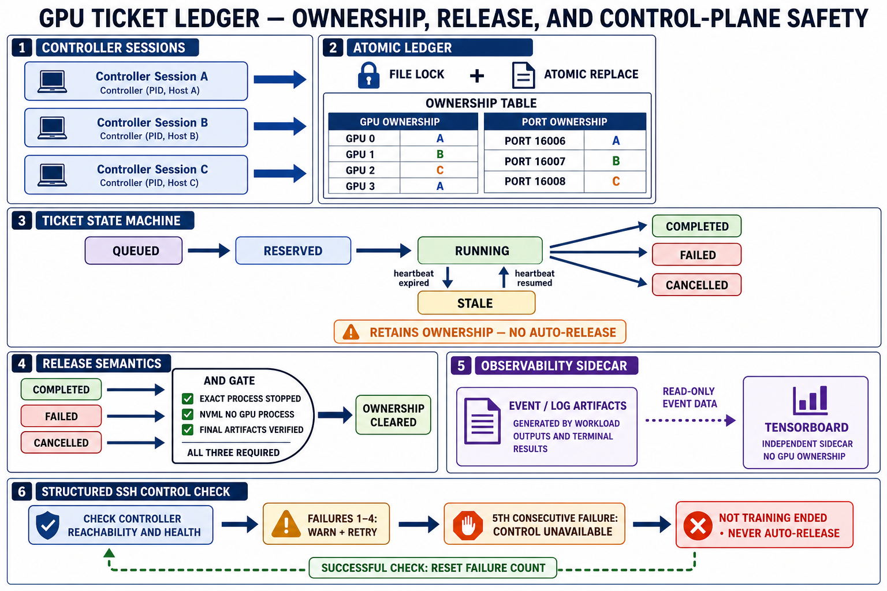
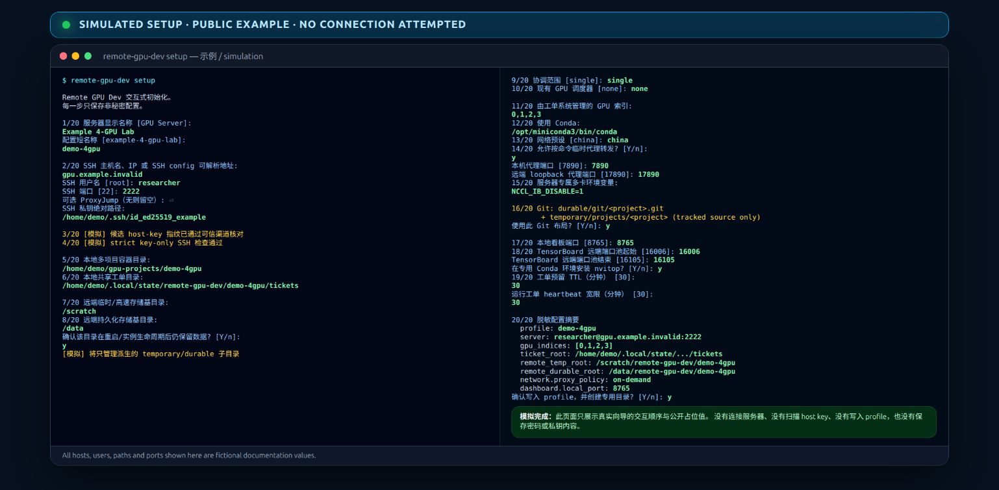
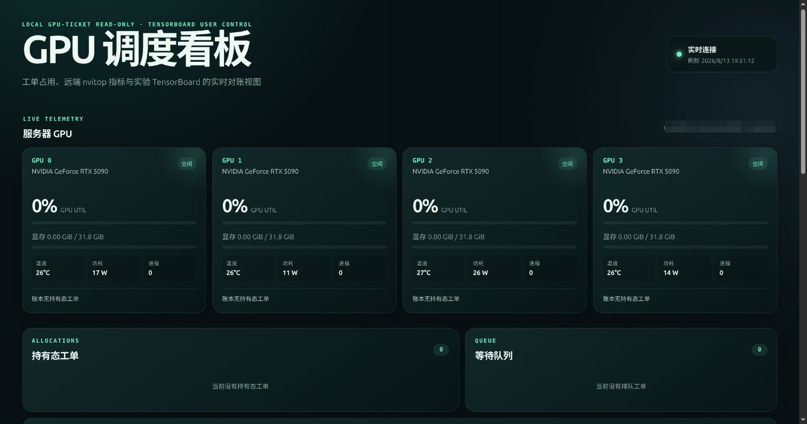
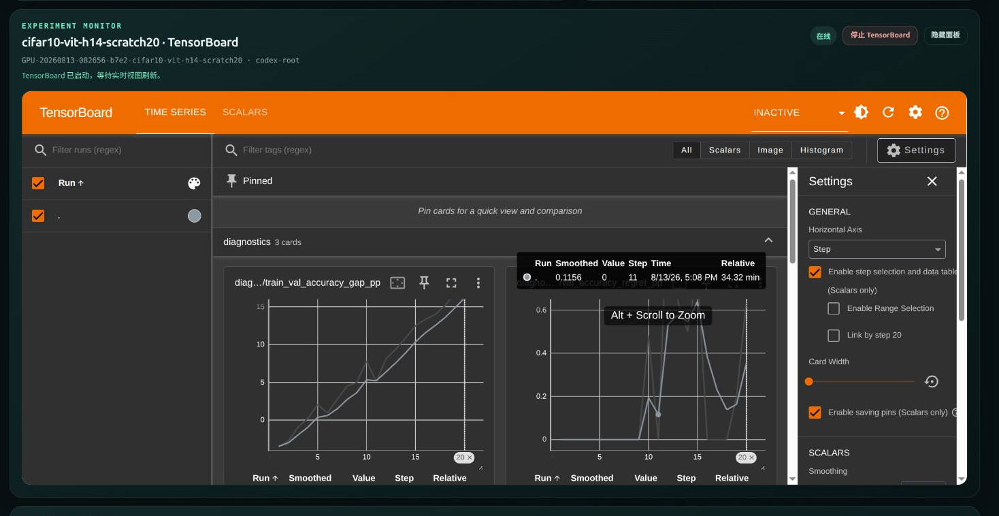

# Codex 远程 GPU 开发

[English](README.md) | 简体中文

`remote-gpu-dev` 是一个可复用的 Codex Skill 和本地 CLI，用于安全地在可通过
SSH 访问的 NVIDIA GPU 服务器上开展开发。它将不同服务器的配置保存为私有
profile，并将源码、GPU 分配、运行产物和监控组件的所有权相互分离。

本仓库可直接用于公开发布：其中不包含原始服务器 profile 或工单账本、凭据或其他
秘密、数据集、权重、checkpoint、训练日志或 TensorBoard event 文件。下方图解只包含
两张生成的架构图、两张经过脱敏的历史看板截图和一张模拟配置界面；连接端点已做
像素马赛克，原始浏览器截图不会进入仓库。

## 兼容性优先的开发契约

这个 Skill 是可演进的开发工具，不是写死的策略。最高优先级是为正常训练、测试、
推理、CUDA/NCCL/DDP、DataLoader worker、编译、checkpoint 保存/加载、日志和结果
保存提供开箱可用且操作路径短的流程。profile 受管根目录、GPU 工单、结构化启动和
基础设施隔离只用于防止受信任的 AI 代码误写其他项目或冲突使用 GPU；它们不得妨碍
正常 PyTorch。根目录由每台服务器的 profile 配置，不是 Skill 写死的通用路径。

一旦复现真实兼容性问题，应局部更新对应的 Skill 指令、helper 和聚焦回归测试，而
不是让项目代码长期绕过过时规则。与问题无关的凭据、所有权、进程身份和破坏性操作
保护应继续保留。这是 trusted-code 工作流，不是 hostile-code containment。

如果任何限制阻碍核心功能，AI 可以直接在最小必要范围内放宽该限制，并同步 helper、
测试、文档和 release metadata。旧限制不是不可突破的规则，其优先级不得高于核心功能
正常可用。

远程监控应容忍常见的 SSH 控制面抖动：只有连续 5 次结构化控制检查失败，才把控制通道
判定为 unavailable；第 1 至 4 次只告警并重试，任意一次检查成功都会把连续失败计数清零。
控制检查失败不能证明训练已经结束，也不能在缺少精确进程、GPU 和最终状态证据时触发
stop 或释放工单。

## 功能

- 逐步完成服务器接入，对 SSH 失败进行分类，并提供公钥配置指导；
- 针对每个 profile 严格校验 known_hosts，并只允许密钥认证；
- 分离 SSH 信任身份与不依赖主机密钥的 GPU 协调身份；
- 使用带文件锁的 GPU 工单账本，供多个 Codex 会话共享；
- 以本地源码为准，通过一个 bare Git 仓库和每项目一个精确执行 clone 部署代码；
- 仅使用 Conda 管理研究环境，并使用独立的 nvitop 基础设施环境；
- 支持 HF/PyPI 镜像策略和按需临时 SSH 反向代理；
- 支持服务器专属的多 GPU 环境变量，例如主机要求的 `NCCL_IB_DISABLE=1`；
- 提供仅绑定本地回环地址的 GPU/工单看板，以及由用户手动控制的 TensorBoard
  viewer；
- 明确采用“先放临时目录、确认长期有用后再持久化”的存储策略；
- 采用双根目录资产策略和与工单绑定的结构化 PyTorch runner，并对基础设施辅助
  进程保留 fail-closed 的 Landlock；
- 禁用任意远程命令和交互式远程 shell。

## 各组件如何协作



*这张图说明什么。* 源码始终以本地 Git 为准，预留 GPU 前先部署一个干净的执行
clone。与工单绑定的 runner 在独立且已登记的运行目录中启动常规 PyTorch、CUDA、
NCCL、DDP 和 DataLoader 工作负载，让 checkpoint、日志与结果只有一个可预测的
落点。GPU 遥测和 TensorBoard event 数据只读进入监控层，不改变工单所有权。
验证阶段先核对最终产物、精确进程身份和已分配 GPU 状态，再释放工单。图中编号依次
对应部署、预留、启动、观测、验证和释放，避免把这些边界隐藏在一次远程 shell 中。

## 信任模型与限制

- 不保存密码、私钥内容、口令、token 或带认证信息的代理 URL；profile 只保存
  identity file 的路径。
- 首次连接时，用户必须通过可信渠道核验 SSH 主机密钥指纹；单独使用
  `ssh-keyscan` 不能证明服务器身份。
- v1 工单账本可以协调同一控制端电脑上的多个会话。只有当工单目录位于真正
  支持 `flock` 和原子 rename 的共享文件系统时，才能协调多台控制端电脑。
  如果服务器已有 Slurm、PBS 或其他调度系统，应优先使用原生调度器。
- v1 分配完整物理 GPU；检测到 MIG 已启用时会 fail closed。
- 看板不是 GPU 调度器；它不会预留 GPU、发送 heartbeat、释放工单或停止 CUDA
  作业。

## 工单账本与所有权



*这张图说明什么。* 多个控制端会话通过带文件锁并原子替换的账本协作，因此每张
物理 GPU 和每个 sidecar 端口都只有一个已登记 owner。工单依次经过 `QUEUED`、
`RESERVED` 和 `RUNNING`，最终进入 `COMPLETED`、`FAILED` 或 `CANCELLED`。heartbeat
过期时仍保留所有权，直到精确进程与 GPU 检查确认可以安全形成终态；单独的 SSH
不确定性不会释放 GPU 或端口。只有 release gate 会清除所有权。TensorBoard 独立
消费只读 event 数据；SSH 控制路径可容忍最多连续 5 次瞬时失败，但不会重放会改变
状态的 launch 或 stop。

## 环境要求

本地：

- 支持 Skill 的 Codex；
- Python 3.11 或更高版本；
- OpenSSH 客户端、`ssh-keyscan`、`ssh-keygen` 和 Git；
- 用于可选看板的浏览器。

远程服务器：

- Linux、OpenSSH Server、NVIDIA 驱动和 `nvidia-smi`；
- 基础设施辅助进程需要 Linux Landlock ABI 5 或更高版本；
- Git、tmux、flock，以及已有的 Conda、Miniforge 或 Miniconda；
- 有权创建专用的受管目录。

接入向导不会静默安装 Conda，也不会修改系统 Python。

## 从已有 checkout 全局安装

```bash
cd /absolute/path/to/codex-remote-gpu-dev
python3 tools/manage_install.py install
python3 tools/manage_install.py check
```

该命令会先校验源文件，再以原子复制方式安装到：

```text
${CODEX_HOME:-$HOME/.codex}/skills/remote-gpu-dev
```

它还会安装 `remote-gpu-dev`、`remote-gpu-dashboard` 和用户级桌面入口。生产安装
使用复制而不是符号链接，因此移动 checkout 不会破坏 Skill。

发布到 GitHub 后，也可以使用标准 Codex Skill 安装器安装以下公开仓库路径：

```text
https://github.com/YukinoshitaLove/codex-remote-gpu-dev/tree/main/skills/remote-gpu-dev
```

如果需要经过校验的更新、命令启动器、桌面入口和可恢复卸载，推荐使用本仓库的
受管安装器。

首次安装后请重启 Codex，以刷新全局 Skill 发现结果。

## 接入第一台服务器

在终端运行：

```bash
remote-gpu-dev setup
```



*这张截图说明什么。* 这是浏览器渲染的逐题接入流程模拟。所有主机名、路径、指纹、
GPU 标识和端口均为虚构值（`example.invalid`）；它不会建立 SSH 连接，也不会写入
profile。它只用于展示问题的顺序和含义，不会公开真实服务器配置。

向导每次只询问一个问题，首先询问服务器名称和 SSH 地址。如果公钥认证失败，
它会给出安全的 `ssh-keygen` 和 `ssh-copy-id` 操作流程；可能出现的密码提示仍只
由你自己的 OpenSSH 终端处理。

Profile 保存在仓库之外：

```text
${XDG_CONFIG_HOME:-$HOME/.config}/remote-gpu-dev/profiles/<slug>.json
${XDG_CONFIG_HOME:-$HOME/.config}/remote-gpu-dev/known_hosts/<slug>
```

工单与看板运行状态同样位于 Git 之外。适用的 profile 和工单路径会使用
`0600`/`0700` 权限。

运行只读就绪检查：

```bash
remote-gpu-dev --profile my-server doctor
remote-gpu-dev --profile my-server gpu --json
```

## 日常工作流

```bash
# 始终先在本地编辑、测试、审查并提交代码。
remote-gpu-dev --profile my-server project deploy my-project

# 在受管根目录下创建项目环境。
remote-gpu-dev --profile my-server infra create-env \
  --prefix /managed/temp/envs/my-project --python 3.12 --package pytorch
remote-gpu-dev --profile my-server infra pip-install-env \
  --prefix /managed/temp/envs/my-project --package tensorboard

# 先检查，再预留 GPU。
remote-gpu-dev --profile my-server ticket status --json
remote-gpu-dev --profile my-server ticket reserve \
  --project my-project --owner "$USER" --purpose "training run" --gpus 2 --expected 4h

# 确认分配到的 GPU 实时空闲后，登记精确启动信息。
remote-gpu-dev --profile my-server ticket start TICKET_ID \
  --confirmed-idle 0,1 --session exact-session \
  --remote-workdir /absolute/run/path --summary "sanitized command summary"

# 运行期间发送 heartbeat；结束时先验证结果、精确停止进程、复查 GPU，
# 再使用真实结果释放工单。
remote-gpu-dev --profile my-server ticket heartbeat TICKET_ID --expected 2h
remote-gpu-dev --profile my-server ticket release TICKET_ID \
  --outcome completed --confirmed-stopped 0,1 \
  --result "result.json and checkpoint verified"
```

本工具有意不提供交互式远程 shell 或任意远程命令。请使用与工单绑定的结构化
runner：

```bash
remote-gpu-dev --profile my-server run TICKET \
  --env-prefix /managed/temp/envs/demo \
  --script /managed/temp/projects/demo/train.py -- --epochs 20
```

runner 会从工单读取 workdir。这样干净的执行 clone 与运行目录相互分离，相对路径
写出的 checkpoint、日志和结果会落到工单记录的运行目录。`--workdir` 仍可作为可选
断言使用，但必须与工单完全一致。需要 Python module 形式时可使用闭合的 ASCII 点号
模块名，例如 `--module torch.distributed.run`。`--` 后的参数会原样传递。

添加 `--session EXACT_TICKET_SESSION` 可以启动后台作业。结构化
supervisor 会在以下目录保存 `identity.json`、`run.log` 和 `final.json`：

```text
remote.temp_root/runtime/runs/TICKET/jobs/SESSION
```

只能使用相同工单检查或停止它。status/stop 会推断工单中记录的 session；显式
`--session` 只有在与工单完全一致时才会接受：

```bash
remote-gpu-dev --profile my-server run TICKET --status
remote-gpu-dev --profile my-server run TICKET --stop
```

停止操作会先核验 boot ID、supervisor PID、进程启动时钟和进程组 leader，再发送
`SIGTERM`；它绝不会退化为只按 PID 或进程名杀进程。`ssh --proxy
--no-command` 只能作为纯端口转发的配套命令使用，SSH 进程结束后转发也会消失。

远程服务器上的所有用户资产——包括代码、文档、记录、数据集、权重、checkpoint、
日志、虚拟环境、下载内容、缓存、临时文件、socket 和生成结果——都必须位于临时
根目录或持久化根目录下。GPU 工作负载使用不启用 Landlock 的兼容模式，使 CUDA、
NCCL、DDP、DataLoader、编译以及 checkpoint/日志/结果写入不依赖逐项系统调用
例外。runner 仍校验工单、受管 workdir、Conda Python 和脚本，重定向缓存与临时
状态，设置 GPU 可见性，不使用 shell，并记录后台进程的精确身份。工作负载代码
必须可信；所有持久化资产留在两个根目录内是操作与代码审查约定。基础设施辅助
进程仍使用 Landlock。

基础设施边界是针对同一 SSH 用户、受信任代码的防误操作保护，不是 VM 或容器级沙箱。
SSH 认证和账号 shell 的命令启动发生在客户端启动 Landlock wrapper 之前，因此
必须信任远程账号及其启动配置。网络访问、GPU DMA 和恶意内核不在此边界内。

## 看板与 TensorBoard

训练程序负责写入 event 文件。通过对应工单配置数据源：

```bash
remote-gpu-dev --profile my-server tensorboard configure TICKET_ID \
  --env-prefix /absolute/conda/env --logdir /absolute/run/events
```

只有用户手动启动或停止前端：

```bash
remote-gpu-dev --profile my-server dashboard open
remote-gpu-dev --profile my-server dashboard status
remote-gpu-dev --profile my-server dashboard stop
```

### 看板总览



*这张截图说明什么。* 仅绑定本地回环地址的看板会为每张 GPU 显示利用率、显存、
温度、功耗和进程上下文，同时显示活动/排队工单计数和历史工单。它是 2026-08-13 的
脱敏历史截图，不代表服务器当前状态。顶部连接端点已经做像素马赛克，原始截图不会
进入仓库。看板始终只读；图中的分配数和排队数均为 0，并不表示看板执行了预留或
释放。

### 工单范围内的 TensorBoard viewer



*这张截图说明什么。* 从工单历史中选中一个已经完成并释放的 CIFAR-10 ViT 20 轮
随机初始化实验（`scratch20`），再通过用户手动启动的 TensorBoard sidecar 嵌入其
真实标量曲线。viewer 的启停不会重新打开任务，也不会改变已经释放的工单状态。
这同样是 2026-08-13 的历史截图，不能证明 TensorBoard、任务或任意 GPU 当前仍在
运行；仓库不包含 event 文件或原始浏览器截图。

TensorBoard sidecar 只会在 SSH 退出码为 255 或 SSH 超时时，对幂等只读的
preflight、status 和精确 absence 检查重试；所有尝试共享一个截止时间，最多 5 次。
结果未知的 launch 和 stop 绝不盲目重放；同一 generation 会保持
`cleanup_pending`，直到精确的 status 或 absence 检查消除不确定性。

桌面启动器会打开当前选中的便捷 profile（通过 `use <slug>` 选择）。自动化命令
应始终显式传入 `--profile`。如果多个别名管理相同的 GPU UUID/index 清单，它们
必须共享同一个工单根目录和看板运行状态；SSH 主机密钥轮换不会创建新的 GPU
分配命名空间。

## 更新与卸载

```bash
git pull --ff-only
python3 tools/manage_install.py update
python3 tools/manage_install.py check

# 可恢复卸载：将已安装 Skill 移到 $CODEX_HOME/skill-backups。
python3 "${CODEX_HOME:-$HOME/.codex}/skills/remote-gpu-dev/scripts/manage_global_install.py" uninstall
```

卸载会保留 profile、工单、记录、数据集和权重。本工具绝不会递归删除用户数据。

## 开发与验证

```bash
PYTHONDONTWRITEBYTECODE=1 python3 -m unittest discover -s tests -v
python3 tools/check_public_tree.py
python3 tools/manage_install.py validate-source
python3 /path/to/skill-creator/scripts/quick_validate.py skills/remote-gpu-dev
```

测试套件只使用本地 fake 和临时目录；常规 CI 不会连接真实服务器，也不会初始化
CUDA。

## 仓库结构

```text
skills/remote-gpu-dev/   可安装的 Codex Skill
tests/                   单元测试、安全测试和状态机测试
tools/                   公开树检查与受管安装辅助工具
examples/                不含秘密的 profile 示例
docs/assets/             已复核的架构图与公开脱敏截图
docs/demos/              离线且完全虚构的接入向导模拟
.github/workflows/       仅本地模拟的 CI
```

公开 fork 前，请先阅读 [SECURITY.md](SECURITY.md)。
